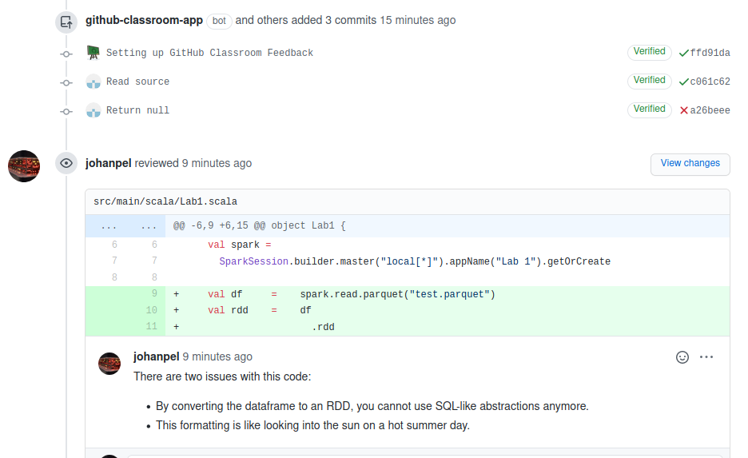

### Code repositories

For this lab, you will write a lot of code. All (incremental additions to) the
code for the lab assignments are kept in a private [git] repository that is
hosted on [GitHub], inside the [GitHub Classroom] used for this course.
(Please don't register yet until you've read the full introduction.) This is the
**only way** to turn in code, any other channels, such as e-mail, are rejected.

If you do not know how to use git, you *must* familiarize yourself with it
first. This is an essential skill for your future career. We consider this a
prerequisite to the course. There are many tutorials online, and sometimes
[cheatsheets] come in handy when you start to use git. There are also [GUIs]
that may be useful to those that don't like working on the command-line.

The snapshot of the code in your assignment repository on the `master` branch,
at the moment the deadline expires, will be your submission. Make sure to make
your last commit before the deadline!

We recommend students to work on branches, and make pull requests to their
`master` branch once the code they are trying to implement is complete. These
pull requests can be reviewed by their teammates or by the TAs to provide early
feedback. This is also an explicit mechanism you will find in GitHub Classroom.

Here is an example of feedback that we can provide based on your pull request:

[git]: https://git-scm.com
[github]: https://github.com
[github classroom]: https://classroom.github.com
[cheatsheets]: https://rogerdudler.github.io/git-guide
[guis]: https://www.gitkraken.com
